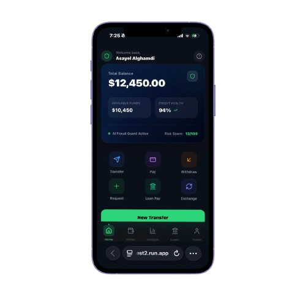
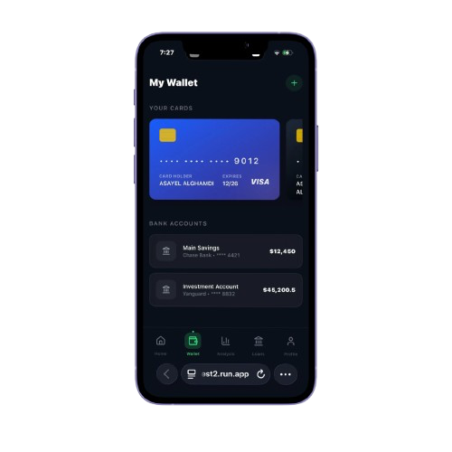
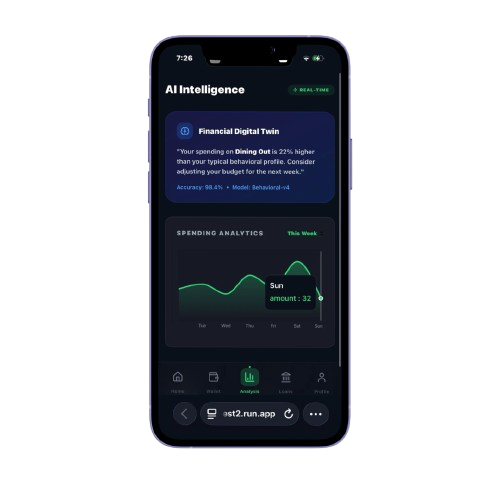
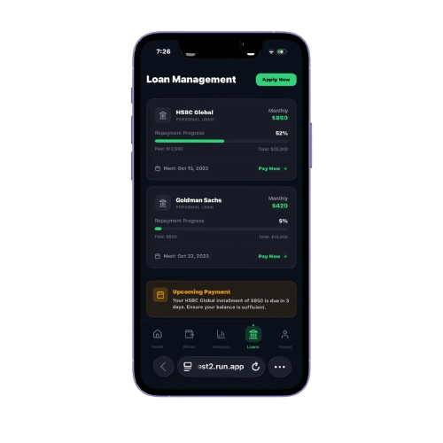
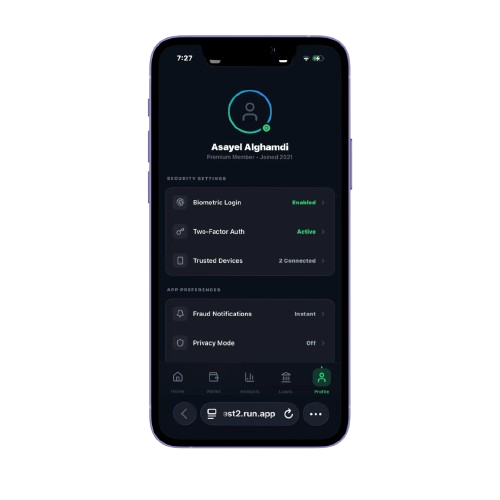
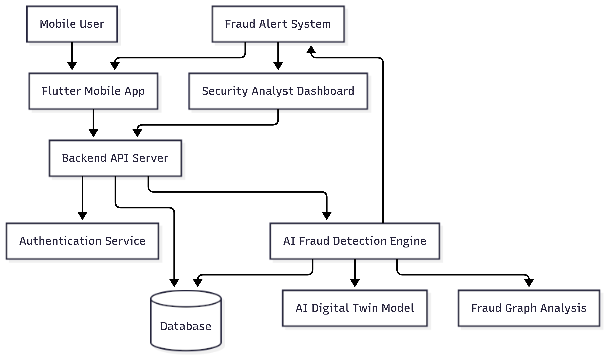
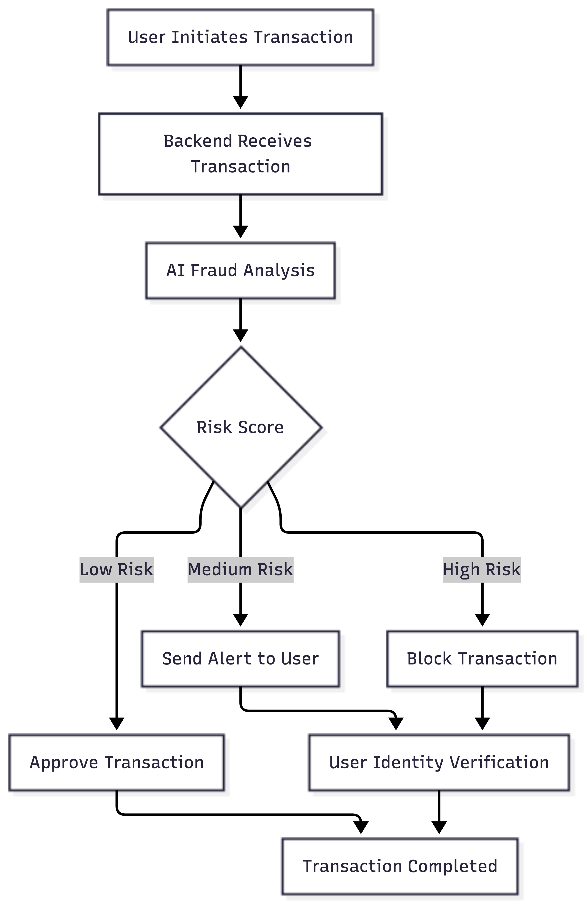

# SmartPro Secure Wallet
**AI-Powered Fintech Security Platform**

SmartPro Secure Wallet is an advanced evolution of a previous loan management system.  
The new platform expands the original concept into a **full AI-powered fintech wallet** with fraud detection, behavioral biometrics, AI digital twin, and intelligent financial analytics.

---

## Project Evolution

SmartPro Secure Wallet is built upon the foundation of a prior loan management application.  
The original project provided:

- Loan monitoring  
- Payment tracking  
- Financial overview  

The upgraded version transforms it into a **next-generation intelligent financial security platform** by adding:

- AI-powered fraud detection  
- Digital twin financial behavior modeling  
- Fraud graph network analysis  
- Behavioral biometrics security  
- Financial insights and analytics  

---

## Key Features

- Digital Wallet for managing multiple accounts and cards  
- AI Fraud Detection System  
- Digital Twin for financial behavior  
- Fraud Graph Network Analysis  
- Behavioral Biometrics Security  
- Financial Analytics and Insights  
- Real-time Fraud Alerts  

---

## App Interface

### 1️⃣ Home Dashboard

- Total balance card  
- Credit health indicator  
- AI fraud risk score  
- Quick actions: Transfer, Pay, Withdraw, Request  
- Recent transactions  
- Fraud alerts  

---

### 2️⃣ Wallet

- Manage bank accounts and cards  
- View balances  
- Add new cards/accounts  
- Transfer funds  
- Transactions analyzed in real-time  

---

### 3️⃣ Financial Analysis

- Spending analytics  
- Income vs expense charts  
- Loan repayment tracking  
- AI financial insights  
- Risk prediction  

---

### 4️⃣ Loans

- View active loans  
- Loan balance tracking  
- Monthly installment overview  
- Loan payment / delay options  
- Fraud alert analysis  

---

### 5️⃣ Profile

- Personal info management  
- Security settings  
- Biometric login  
- Two-factor authentication  
- Connected devices  
- Fraud alert history  

---

## System Diagrams

### Architecture Diagram

This diagram shows the overall system architecture:

- Mobile Users interact with the **Flutter App**  
- The app communicates with the **Backend API Server**  
- Authentication, AI Fraud Engine, Digital Twin, and Fraud Graph systems handle the security and analysis  
- Database stores all user, transaction, and behavioral data  
- Alerts are sent to users and the admin dashboard  

---

### System Workflow

This diagram illustrates the **transaction process**:

1. User initiates a transaction  
2. Backend receives the request  
3. AI analyzes transaction data and calculates a risk score  
4. Depending on the risk score:
   - Low: Transaction approved  
   - Medium: Alert user  
   - High: Block and request verification  
5. Verified transactions are completed  

---

## AI Components

- Fraud Detection Engine  
- AI Digital Twin  
- Fraud Graph Network Analysis  
- Behavioral Biometrics Security  

---

## Security Features

- AES-256 encryption  
- JWT authentication  
- Two-factor authentication (OTP, Biometric)  
- Real-time fraud detection  
- Behavioral verification  

---

## Database Structure

**Tables:**  
Users, Transactions, Devices, FraudAlerts, FraudGraphEdges, UserBehaviorProfiles

---

## Author

**Asayel Alghamdi**  
Computer Science Student — Cybersecurity & Data Analysis

---
